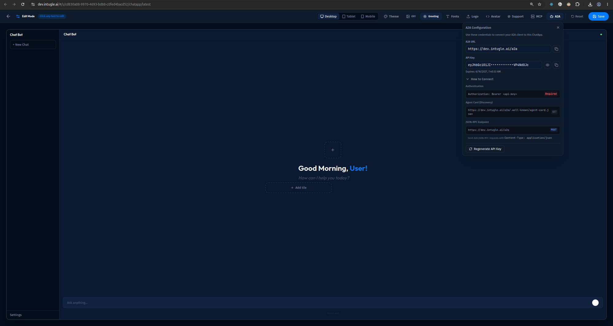

# Getting Started with A2A

This guide shows how to integrate your application with Intugle using the A2A protocol.

## Video Tutorial

<div style={{position: 'relative', paddingBottom: '56.25%', height: 0, overflow: 'hidden', maxWidth: '100%'}}>
  <iframe 
    style={{position: 'absolute', top: 0, left: 0, width: '100%', height: '100%'}}
    src="https://www.youtube.com/embed/4IhklzXfASg" 
    title="A2A Integration Tutorial"
    frameBorder="0" 
    allow="accelerometer; autoplay; clipboard-write; encrypted-media; gyroscope; picture-in-picture" 
    allowFullScreen>
  </iframe>
</div>

## Getting Credentials

1. Navigate to your deployed **ChatApp** in Intugle
2. Open **Settings** → **A2A Connection Info**
3. Copy the **A2A URL** and **API Key**



The A2A Configuration panel shows:
- **A2A URL**: Your endpoint (e.g., `https://dev.intugle.ai/a2a`)
- **API Key**: Your JWT token (masked, with copy button)
- **Expiration**: Token expiry date
- **Authentication**: Required `Authorization: Bearer <api-key>` header
- **Agent Card (Discovery)**: `GET` endpoint at `/.well-known/agent-card.json`
- **JSON-RPC Endpoint**: `POST` endpoint with `Content-Type: application/json`

## Quick Example

### Python

```python
import httpx
import json

A2A_URL = "https://your-instance.intugle.ai/a2a/"
API_KEY = "your-jwt-token"

async def query_intugle(question: str):
    request = {
        "jsonrpc": "2.0",
        "method": "message/send",
        "params": {
            "message": {
                "message_id": "msg-001",
                "role": "user",
                "parts": [{"text": question, "media_type": "text/plain"}]
            }
        },
        "id": "1"
    }
    
    async with httpx.AsyncClient() as client:
        async with client.stream(
            "POST", A2A_URL,
            json=request,
            headers={
                "Authorization": f"Bearer {API_KEY}",
                "Content-Type": "application/json",
                "Accept": "text/event-stream"
            },
            timeout=300
        ) as response:
            async for line in response.aiter_lines():
                if line.startswith("data: "):
                    event = json.loads(line[6:])
                    print(event)

# Usage
import asyncio
asyncio.run(query_intugle("What were our total sales last month?"))
```

### cURL

```bash
curl -X POST "https://your-instance.intugle.ai/a2a/" \
  -H "Authorization: Bearer YOUR_API_KEY" \
  -H "Content-Type: application/json" \
  -H "Accept: text/event-stream" \
  -d '{
    "jsonrpc": "2.0",
    "method": "message/send",
    "params": {
      "message": {
        "message_id": "msg-001",
        "role": "user",
        "parts": [{"text": "Show me revenue by region", "media_type": "text/plain"}]
      }
    },
    "id": "1"
  }'
```

## Understanding Responses

The A2A server streams Server-Sent Events (SSE):

```
data: {"type": "task.created", "task": {"id": "task-123", "state": "submitted"}}
data: {"type": "task.updated", "task": {"id": "task-123", "state": "working"}}
data: {"type": "artifact.updated", "artifact": {...}}
data: {"type": "task.updated", "task": {"id": "task-123", "state": "completed"}}
```

### Task States

| State | Description |
|-------|-------------|
| `submitted` | Request received |
| `working` | Processing in progress |
| `input_required` | Waiting for user input |
| `completed` | Success |
| `failed` | Error occurred |
| `canceled` | User canceled |

### Handling Events

```python
async for line in response.aiter_lines():
    if not line.startswith("data: "):
        continue
    
    event = json.loads(line[6:])
    event_type = event.get("type")
    
    if event_type == "task.updated":
        state = event["task"]["state"]
        if state == "completed":
            print("Done!")
        elif state == "failed":
            print(f"Error: {event['task'].get('error')}")
    
    elif event_type == "artifact.updated":
        artifact = event["artifact"]
        # Process markdown, table, chart, or card
```

## Session Continuity

Use `context_id` to maintain conversation context:

```python
# First message
request1 = {
    "jsonrpc": "2.0",
    "method": "message/send",
    "params": {
        "message": {
            "message_id": "msg-001",
            "context_id": "session-abc",  # Set context
            "role": "user",
            "parts": [{"text": "Show me sales by region", "media_type": "text/plain"}]
        }
    },
    "id": "1"
}

# Follow-up message (uses same context)
request2 = {
    "jsonrpc": "2.0",
    "method": "message/send",
    "params": {
        "message": {
            "message_id": "msg-002",
            "context_id": "session-abc",  # Same context
            "role": "user",
            "parts": [{"text": "Now filter to Q4 only", "media_type": "text/plain"}]
        }
    },
    "id": "2"
}
```

## Next Steps

- [API Reference](./api-reference.md) - Complete input/output specifications
