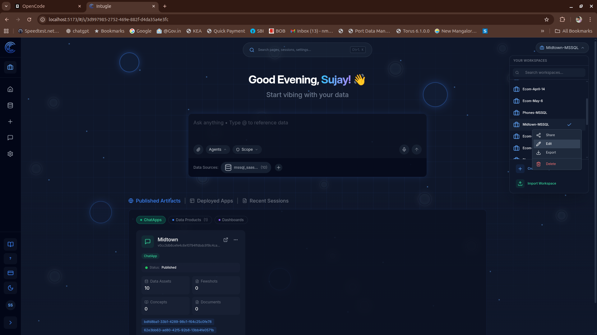
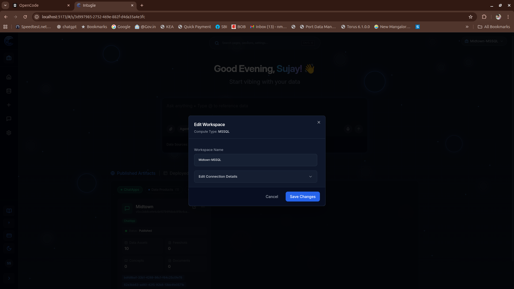
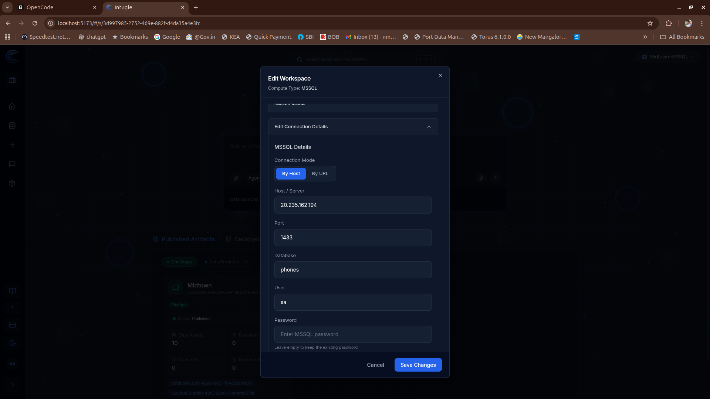

# Editing Workspace Compute Connection Details

This guide explains how to edit the compute connection details for a workspace.

## Steps to Edit Workspace Connection

To edit the compute connection details for an existing workspace:

1. Navigate to the **Workspaces** list.
   
2. Click edit button a dialog will appear, you can edit workspace name and if you click-on drop-down you can edit workspace compute details.
   
3. Update the necessary compute connection details and save your changes.
   
