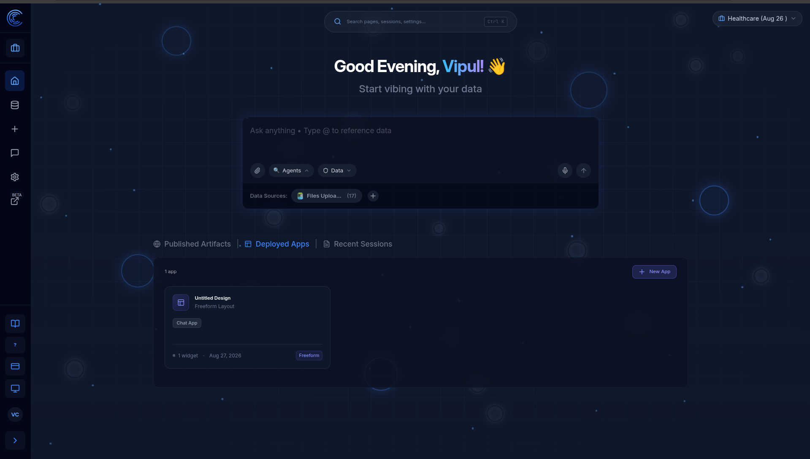
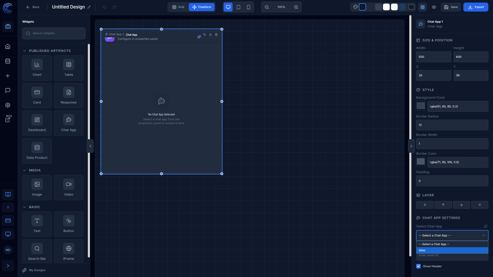
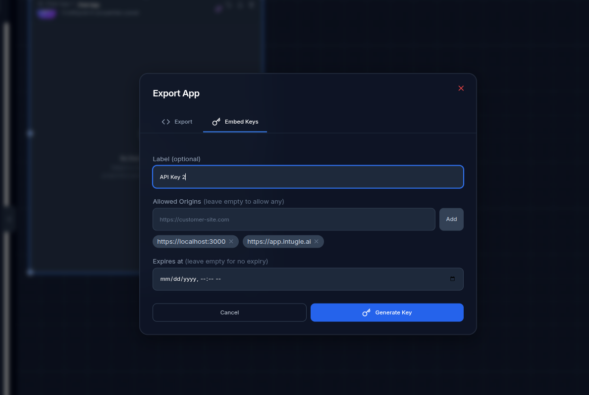
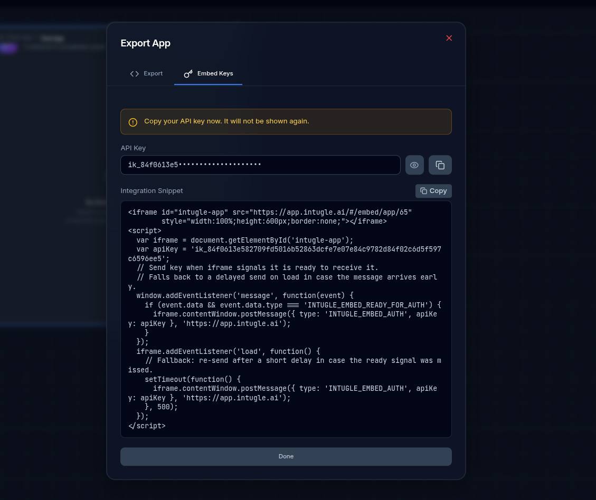
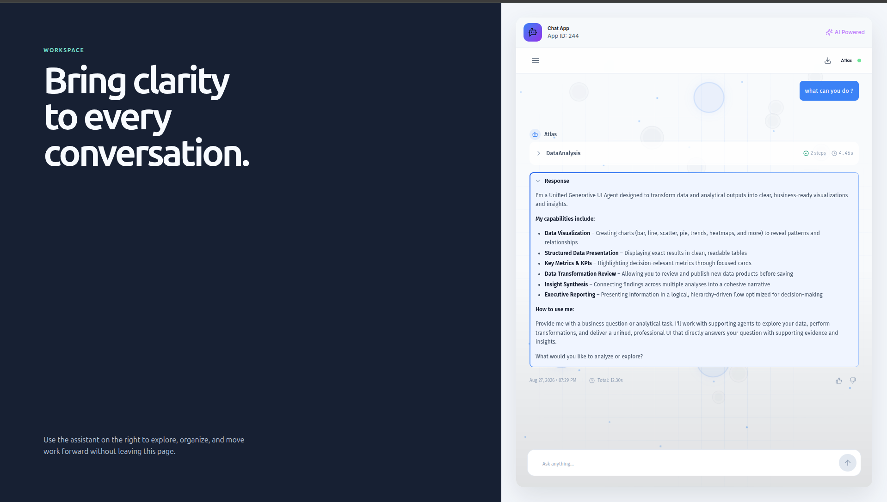

# Embed a ChatApp with an Iframe

Embed a deployed Intugle ChatApp in your website by creating an app that contains a Chat App widget, then using its generated integration snippet.

## Prerequisites

Before you begin, make sure that the ChatApp you want to embed has already been created, configured, and deployed.

You also need the HTTPS origin of the website that will host the iframe. For example, if the iframe will be added to `https://customer-site.com/account`, its origin is `https://customer-site.com`.

## 1. Create an App

From the Intugle home page, open the **Deployed Apps** tab and select **New App**.

## 2. Add and Configure the Chat App Widget

In the app designer, drag the **Chat App** widget from **Published Artifacts** in the left panel onto the canvas.

Select the widget. In the right-side properties panel, open **Chat App Settings** and select the deployed ChatApp that you want to embed. Adjust the widget's size and position as needed.

## 3. Create an Embed Key

Select **Export** in the app designer, then open the **Embed Keys** tab.

In **Allowed Origins**, add both of the following origins:

1. The HTTPS origin of the website where the iframe will run, such as `https://customer-site.com`.
2. The Intugle application origin: `https://app.intugle.ai`.

The website origin must use `https://`. Add each origin separately, then select **Generate Key**.

:::warning Keep the key secure
Copy the generated API key when it is displayed. It is shown only once. Do not commit the integration snippet or embed key to a public repository.
:::

## 4. Add the Integration Snippet to Your Website

After the key is generated, copy the **Integration Snippet** from the **Embed Keys** tab and paste it into the HTML of the page that will host the ChatApp.

The generated snippet creates the iframe and securely sends the embed key to `https://app.intugle.ai` after the iframe is ready. Use the snippet as generated; do not replace its target origin or expose the key outside the authorized host page.

When you publish the host page, the embedded ChatApp will load inside the iframe.

## Result

Your website can now present the deployed ChatApp directly within its own page, so users can interact with it without leaving your site.

