# Workspace Import/Export Guide

## Overview
This guide explains how to export and import workspaces, what data is included in the process, and how different settings affect your newly imported environment.

### Common Use Cases
A primary use case for the import/export functionality is promoting workspaces across environments. For example, you can fully configure and test your workspace in a staging or lower environment, and then export and import it to seamlessly move those configurations into your production environment.

## Exporting a Workspace

**⚠️ IMPORTANT: Commit Your Changes!**
Before exporting, you must ensure that all changes in your semantic layer have been committed. Any uncommitted changes will **NOT** be included in the final export bundle.

To export an existing workspace:
1. Navigate to the **Workspaces** list.
   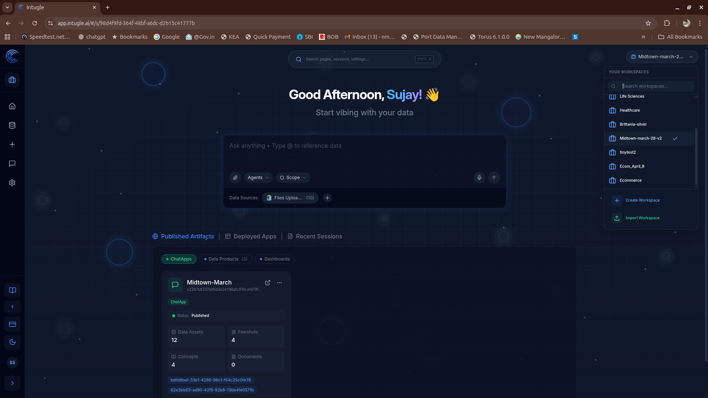
2. Click the **Three-dots Menu** next to the workspace you want to export.
   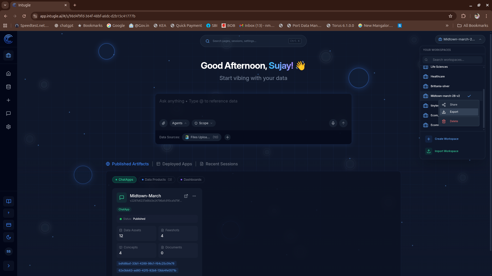
3. Select **Export** and wait for the workspace data to be packaged.
   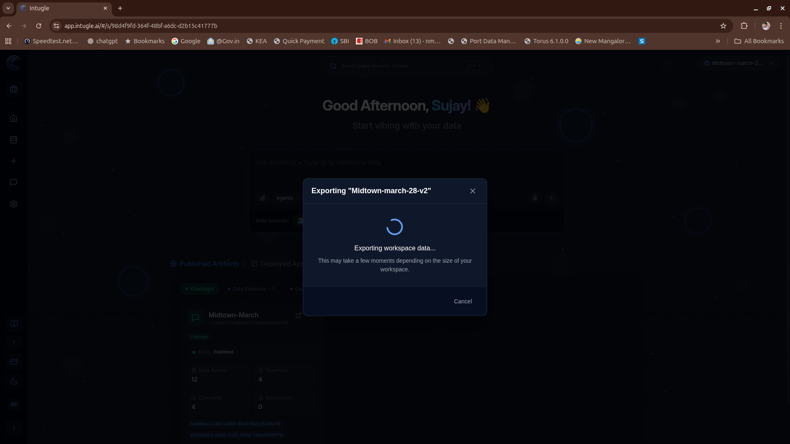

## What is Included in the Export?
When you export a workspace, the system captures the following core components:

### Exported Artifacts and Core Configurations
- Workspace settings and subscription details
- Source connections (including credentials)
- Conversation bot configurations
- Execution engine configurations
- Unstructured file metadata
- `semantic_layer` (Contains your data assets, catalogue columns, links, and domains)
- `fewshots` (Your few-shot training examples)
- `prompts` (System and custom prompts)
- `analytics-catalogue` (Custom concepts)
- `universal-instruction`
- `use-case summary`

### Chat History (Filtered)
To keep the export lightweight and relevant, **general chat history is NOT exported**.
Only user query sessions that are functionally required are included:
- **Cached Questions:** Sessions linked to cached search questions.
- **Data Products:** Sessions linked to generated data products.

## What is NOT Included?
The following features are intentionally skipped during export and will not be available in the newly imported workspace:
- **Deployed Artifacts / Deployed ChatApps**
- **Dashboards and Dashboard Widgets**

## Importing a Workspace
To import a workspace:
1. Go to the workspaces screen and click on **Import Workspace**.
   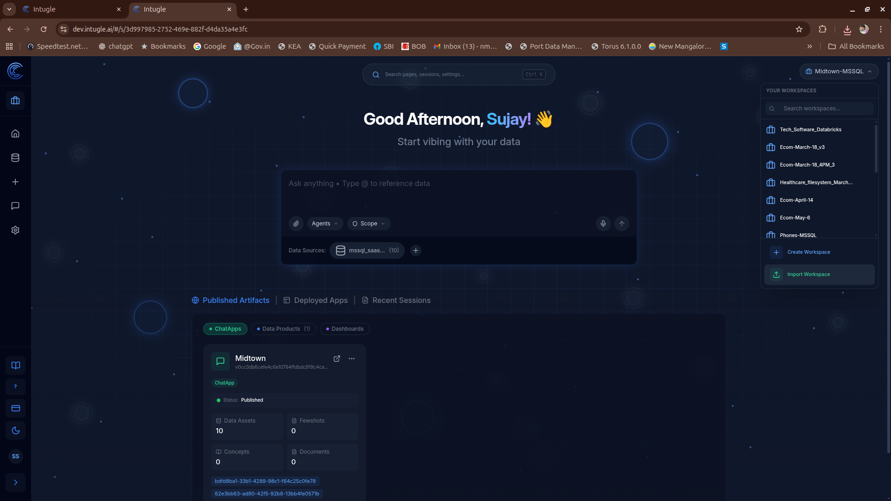
   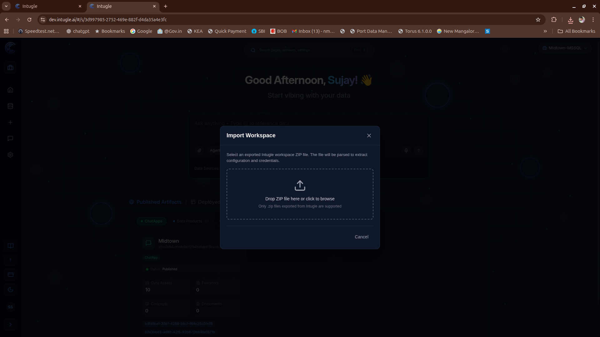
2. **Upload the exported workspace ZIP file:** After uploading, the dialog box will display the pre-populated compute connection details from the exported workspace. 
   - You can edit these connection details directly in this dialog to point to your new destination database (e.g., your staging or production database).
   - **⚠️ Important Note for "Recreate" Vector Collections:** If you are importing into an environment with a different database, you **must** update the credentials here before proceeding. Because vector collection jobs are automatically triggered immediately after the import, they need the correct database credentials to query the right data.
   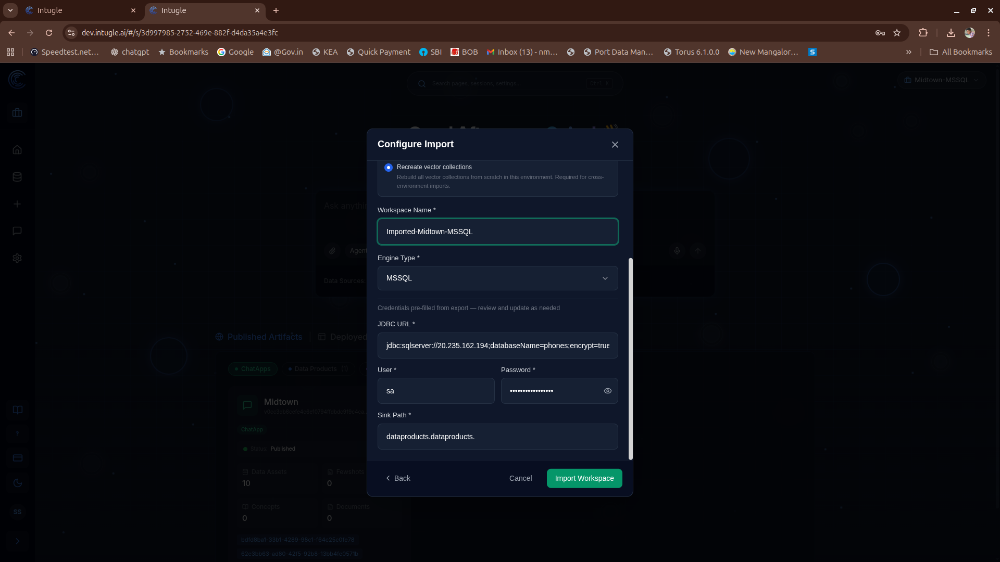
3. Select the **Vector Collection** import option.
   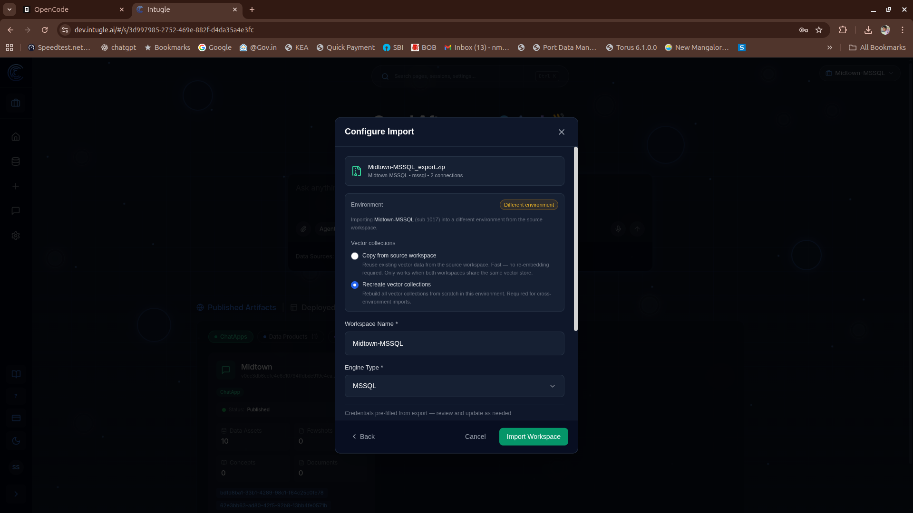

   **Vector Collections: Recreate vs. Copy**
   - **Copy:** The system will perform a direct snapshot copy of vector collections from the source workspace to the new one. This is faster but only works if the source and destination are on the same environment.
   - **Recreate:** The system skips copying and will rebuild or re-embed the vector collections from scratch using your database rows and background processing jobs. Use this when importing across different environments.
   
   **ℹ️ Note:** The application will automatically select the appropriate option (Copy or Recreate) based on your source and destination environments. It is advised to keep the auto-selected option unless you are certain you need to override it.

4. Click **Import** and wait for the process to complete.
   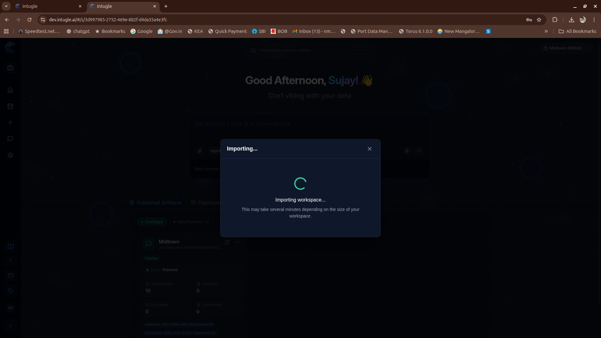

## Post-Import Checklist
After your workspace is imported, complete these configuration tasks:

1. **Update API Keys:** The new ChatApp deployment will require a fresh API key. You will need to update your integrations to use this newly generated key.
2. **Background Jobs:** Background jobs for autocorrection and row-shortlisting will be automatically triggered after import. You will see these appear as active jobs in your workspace on the Deploy ChatApp and [Prompt-Flow](../prompt-flow.md) Jobs page. For more details, see [Caveats: Deploying a ChatApp After Workspace Import](#caveats-deploying-a-chatapp-after-workspace-import).
   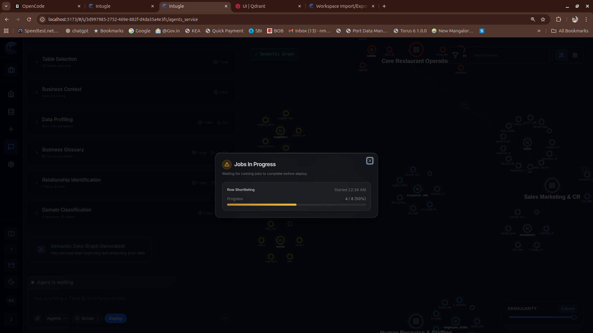
3. **Update Compute Connection Details:** When promoting a workspace across environments (e.g., from staging to production) where the destination requires different source databases, you may need to manually edit the workspace's compute connection details to point to the correct production data source. See the [Edit Workspace Compute Connection Details](./edit-workspace-compute.md) guide for instructions.

## Caveats: Deploying a ChatApp After Workspace Import
Because Deployed ChatApps are excluded from the export bundle, you must trigger a new ChatApp deployment for the newly imported workspace. The deployment process following a workspace import has specific monitoring and setup steps:

### 1. Launch the ChatApp Deployment
- Click the **Deploy ChatApp Wizard** button to start the process.
  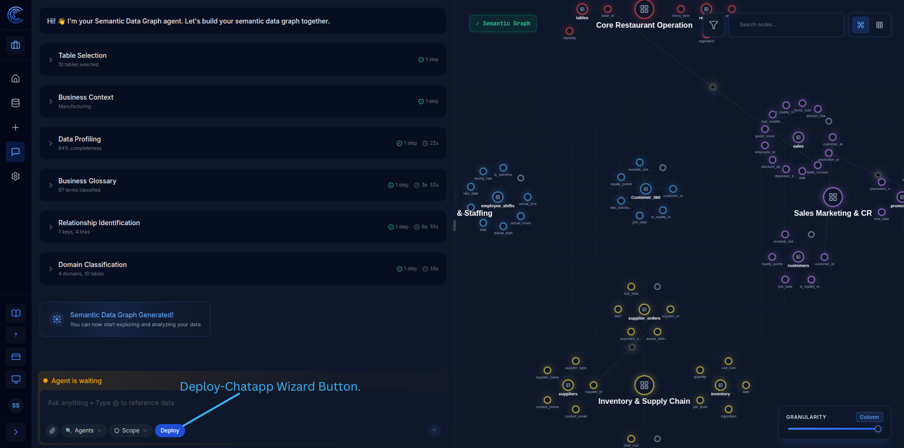
- You will see the **Deploy Prechecks** dialog box. This dialog shows the status of the post-import vector collection setup jobs — including Fewshot, Analytics-Catalogue, Auto-Correction, and Row-Shortlisting vector collection jobs. You can also view the detailed status of these jobs in the [Prompt-Flow](../prompt-flow.md) > **Jobs** page under run logs.
  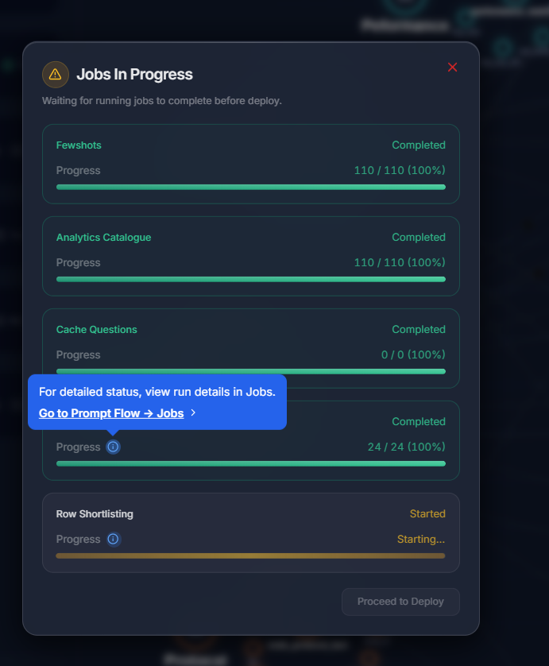
- If a vector collection deployment fails, you can click the button to **retry** it. By default, the system allows only one vector collection job at a time, so you can retry only after all jobs have reached a terminal state (Completed or Error).
  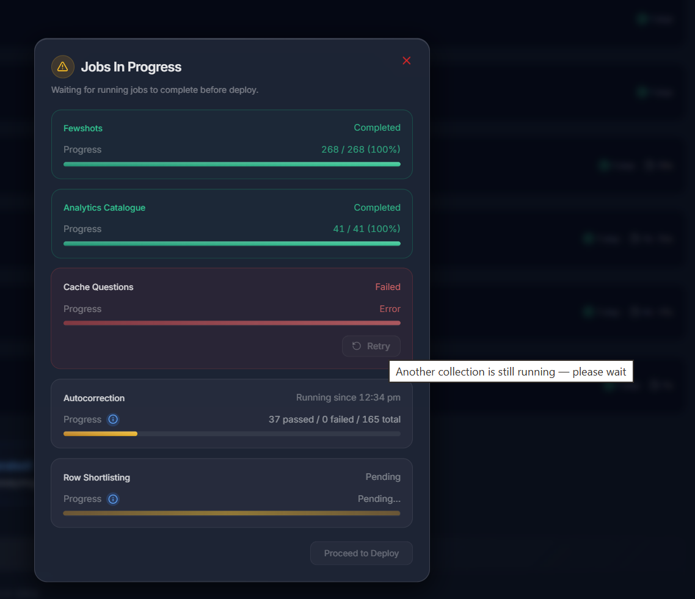

### 2. Vector Collection Setup & Monitoring
After importing, the post-import vector collection setup is automatically triggered.
- The Job Run Logs page will show the progress of the **post-import vector collection setup**.
  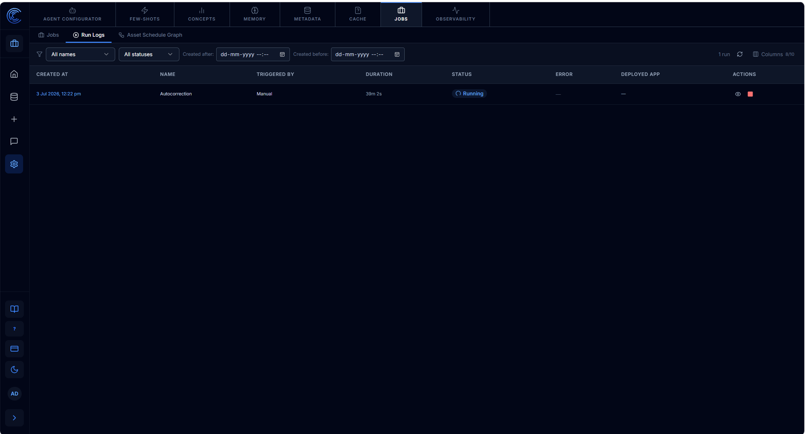
- You can click to **view detailed status** for more information.
  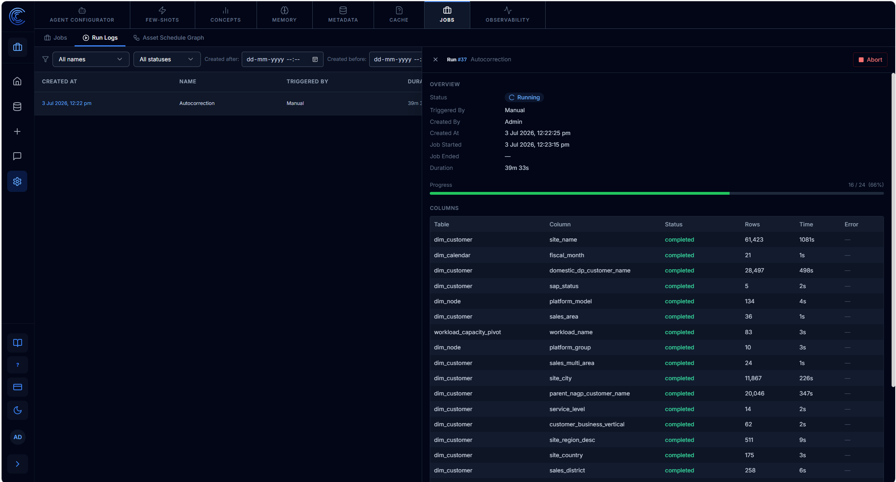

